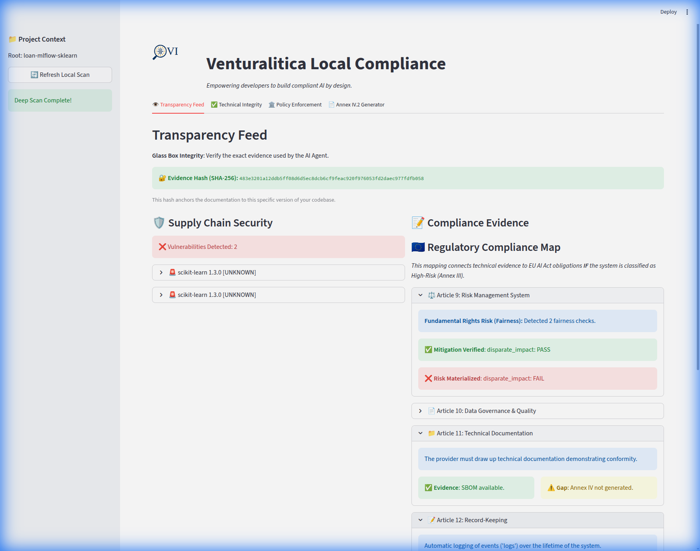

# The Compliance Dashboard: A Glass Box for AI

The **Venturalitica Compliance Dashboard** is your local control center for AI Governance. Unlike "Black Box" compliance tools that operate behind closed doors, Venturalitica provides is a **Glass Box** experience: it exposes the exact technical evidence your system is producing and maps it directly to regulatory obligations.

The dashboard makes the abstract concrete. It takes the invisible artifacts of your ML pipeline—metrics, logs, dependencies—and renders them into a **Regulatory Traceability Matrix**.

## The Sequential Regulatory Map (Articles 9-15)

The core feature of the dashboard is the strict sequential mapping of the **EU AI Act** requirements for High-Risk AI Systems (Chapter III, Section 2). This "Compliance Walk" guides you through the lifecycle of a compliant system.

### The Traceability Flow

#### 1. Article 9: Risk Management System
*   **The Law**: You must identify and mitigate risks to health, safety, and fundamental rights.
*   **The Code**: Venturalitica maps your **Fairness Audits** here. If you run a bias check (e.g., `gender-bias`), the result is the technical evidence that you are monitoring Fundamental Rights risks.
*   **Status**:
    *   `Mitigation Verified`: Your fairness tests passed.
    *   `Risk Materialized`: A test failed (e.g., Disparate Impact detected).

#### 2. Article 10: Data Governance
*   **The Law**: Training, validation, and testing data must be relevant, representative, and error-free.
*   **The Code**: Maps to your **Data Quality Checks** (e.g., class imbalance, missing values) and usage of data libraries (`pandas`, `numpy`).
*   **Status**: Flags if data validation was skipped or failed.

#### 3. Article 11: Technical Documentation (Annex IV)
*   **The Law**: You must maintain up-to-date technical documentation demonstrating conformity.
*   **The Code**: Checks for the presence of your **Software Bill of Materials (SBOM)** (generated by `venturalitica scan`) and the **Technical File Draft** (generated by `venturalitica doc`).
*   **Status**: Green if artifacts exist; Yellow/Red if documentation is missing.

#### 4. Article 12: Record-Keeping
*   **The Law**: Automatic logging of events over the system's lifetime to ensure traceability.
*   **The Code**: Verifies two critical components:
    *   **Cryptographic Anchoring**: Displays the SHA-256 hash of your evidence, proving data integrity.
    *   **Execution Traces**: Confirms that runtime metadata (`runtime_meta`) was captured during training/inference.

#### 5. Article 13: Transparency & Information
*   **The Law**: The system must be sufficiently transparent to allow users to interpret outputs.
*   **The Code**: Checks for **Code Opacity**. Is the source code accessible for audit? Are instructions provided?

#### 6. Article 14: Human Oversight
*   **The Law**: The system must be designed to be overseen by natural persons (human-in-the-loop).
*   **The Code**: Scans for "Stop Button" logic or interactive interfaces (e.g., Streamlit apps, Jupyter notebooks) that imply human control capability.

#### 7. Article 15: Accuracy, Robustness & Cybersecurity
*   **The Law**: The system must be resilient to errors and attacks.
*   **The Code**:
    *   **Accuracy**: Maps to your **Performance Metrics** (Accuracy, F1, Recall).
    *   **Cybersecurity**: Checks for **Supply Chain Vulnerabilities** (CVEs) in your dependencies via the SBOM scan.

## Why This Matters

This sequential layout transforms compliance from a chaotic checklist into a **logical engineering workflow**:

1.  **Assess Risk** (Art 9)
2.  **Clean Data** (Art 10)
3.  **Document It** (Art 11)
4.  **Log It** (Art 12)
5.  **Explain It** (Art 13)
6.  **control It** (Art 14)
7.  **Secure It** (Art 15)

By following this flow, you are structurally aligning your AI system with the law, line by line.
