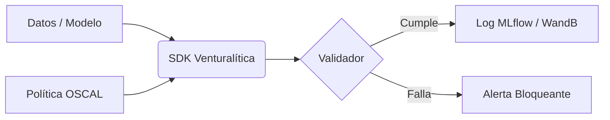

# Venturalítica SDK

***Gobernanza "Sin Fricción" para Sistemas de IA.***

**Venturalítica SDK** integra la gobernanza de IA directamente en tu código Python. Convierte políticas legales abstractas (como la norma EU AI Act) en **Tests Unitarios Ejecutables**.

---

## ⚡ ¿Por qué Venturalítica?

### 🛡️ Cumplimiento como Código
Deja de luchar con PDFs legales. Define tus políticas en **OSCAL** (el estándar de NIST) y ejecútalas automáticamente en tu pipeline de MLOps.

### 🔍 Caja de Cristal (Glass Box Transparency)
Genera automáticamente la documentación técnica requerida por el **Anexo IV de la EU AI Act** y normas ISO 42001.

### 🇪🇺 Soberanía Local (Privacy-First)
Tu código, tus datos, tu infraestructura. El SDK se ejecuta **100% en local**. Ni un solo byte de tus datos de entrenamiento sale de tu servidor.

## ✨ Características Clave

- **Gobernanza de Caja de Cristal**: Mapeo regulatorio secuencial (Art 9-15) para transparencia total.
- **Modo Estricto**: Auto-aplicación de verificaciones de cumplimiento en entornos CI/CD.
- **Procedencia Profunda**: Rastrea el linaje de datos a través de Archivos, SQL y S3 usando `ArtifactProbe`.
- **Arquitectura TraceCollector**: Recopilación unificada de evidencia para BOM, métricas y logs.
- **Auditorías Educativas**: Descripciones de control que explican *por qué* importan las métricas.
- **Integraciones Profundas**: Sincronización perfecta con MLflow y WandB.
- **Nativo de OSCAL**: Política como Código usando formatos estándar de NIST.
- **Listo para Anexo IV**: Auto-redacción de documentación técnica a partir de trazas locales.

---

## 🚀 Inicio Rápido

Instala la librería:

```bash
pip install venturalitica
```

Ejecuta tu primera auditoría de sesgo (Bias Audit):

```python
import venturalitica as vl

# Carga un dataset de ejemplo y audítalo contra la EU AI Act
resultados = vl.quickstart('loan')
```

**Resultado en consola:**
```text
[Venturalítica] 🎓 Escenario: Credit Scoring Fairness
[Venturalítica] 🛡️  Política: EU AI Act - Préstamos Justos

╭─────────── Resultados de Auditoría ───────────╮
│ Control  │ Métrica              │ Valor │ Estado │
├──────────┼──────────────────────┼───────┼────────┤
│ fair-gen │ demographic_parity   │ 0.08  │ ✓ PASS │
╰──────────┴──────────────────────┴───────┴────────╯

🎉 ¡Todas las métricas de equidad aprobadas!
```

---

## 📚 Documentación

*   **[Tutorial: Primera Auditoría](quickstart.md)**
*   **[Integración con Entrenamiento (MLOps)](training.md)**
*   **[El Mapa Regulatorio (Art 9-15)](compliance-dashboard.md)**
*   **[Referencia de API](api.md)**

---

## 🏗️ Arquitectura

El SDK actúa como un puente entre tus datos y la regulación:



---

<center>
    Hecho con ❤️ en Europa para una IA confiable.
</center>
